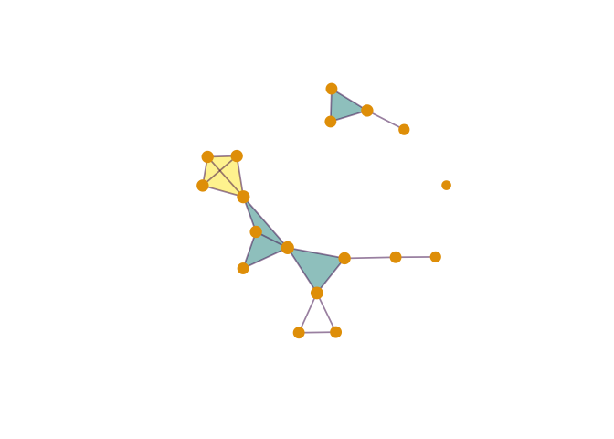

<!-- README.md is generated from README.Rmd. Please edit that file -->

**Note:** Development of this package has been discontinued. A
convenient, elegant, and compact R package for analyzing simplicial
complexes can be found in [Matt Piekenbrock’s
**simplextree**](https://github.com/peekxc/simplextree).

# **sc**: simplicial complexes encoded as bipartite graphs

**sc** is a convenience package for encoding simplicial complexes in R
as bipartite graphs using the **igraph** package. It is intended for
temporary use, until superior functionality and perforance are achieved
by other medium-level packages, for example an R interface to [the GUDHI
C++ library](http://gudhi.gforge.inria.fr/) — or until i become aware of
them\!

## Installation

Install the package from GitHub using [the **remotes**
package](https://github.com/r-lib/remotes):

``` r
remotes::install_github("corybrunson/sc")
```

## Example

A popular illustration from Wikimedia Commons provides an illustration:

``` r
library(sc)
#> Loading required package: igraph
#> 
#> Attaching package: 'igraph'
#> The following objects are masked from 'package:stats':
#> 
#>     decompose, spectrum
#> The following object is masked from 'package:base':
#> 
#>     union
# load data
data(wiki_sc)
# inspection and visualization
print(wiki_sc)
#> # A simplicial complex of 12 faces on 18 vertices
#> #
#> # Vertex data: 18 x 2
#>     .id name 
#>   <int> <chr>
#> 1     1 1    
#> 2     2 3    
#> 3     3 4    
#> 4     4 2    
#> 5     5 5    
#> # … with 13 more rows
#> #
#> # Face data: 12 x 2
#>     .id name 
#>   <int> <chr>
#> 1    19 a    
#> 2    20 b    
#> 3    21 c    
#> 4    22 d    
#> 5    23 e    
#> # … with 7 more rows
plot(wiki_sc, vertex.label = NA)
```



``` r
# vertices and simplices
sc_vertices(wiki_sc)
#> + 18/30 vertices, named, from 734dc45:
#>  [1] 1  3  4  2  5  6  7  8  9  10 11 12 13 14 15 16 17 18
sc_simplices(wiki_sc)
#> + 12/30 vertices, named, from 734dc45:
#>  [1] a b c d e f g h i j k l
```
